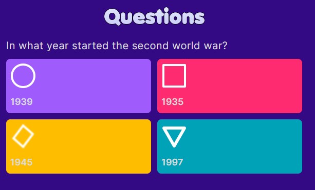

# Questions

Kahoot clone | Frontend side

This is meant to be a Kahoot clone to make questionnaries quickly and easily.

# User Interface
The UI is very similar to that of the actual Kahoot, with missing parts, but it's in constant progress.

  
  

# Stack
- Vite.js
- React.js
- TypeScript
- Tailwindcss
- Playwright (testing)

# Backend Side
There is another repository exclusively handling the backend side of this project, which you can find here: https://github.com/irvingvjuarez/questions-be
